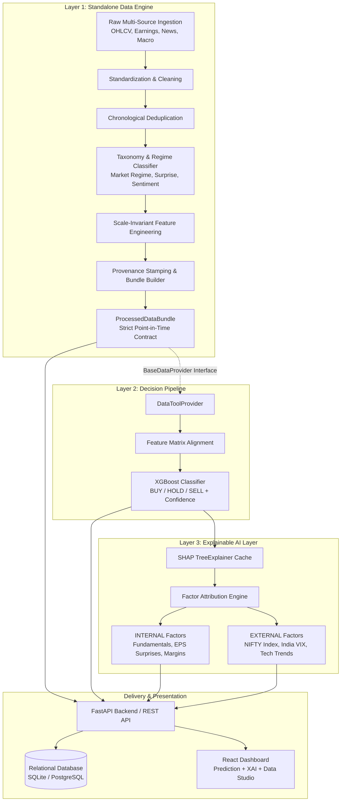
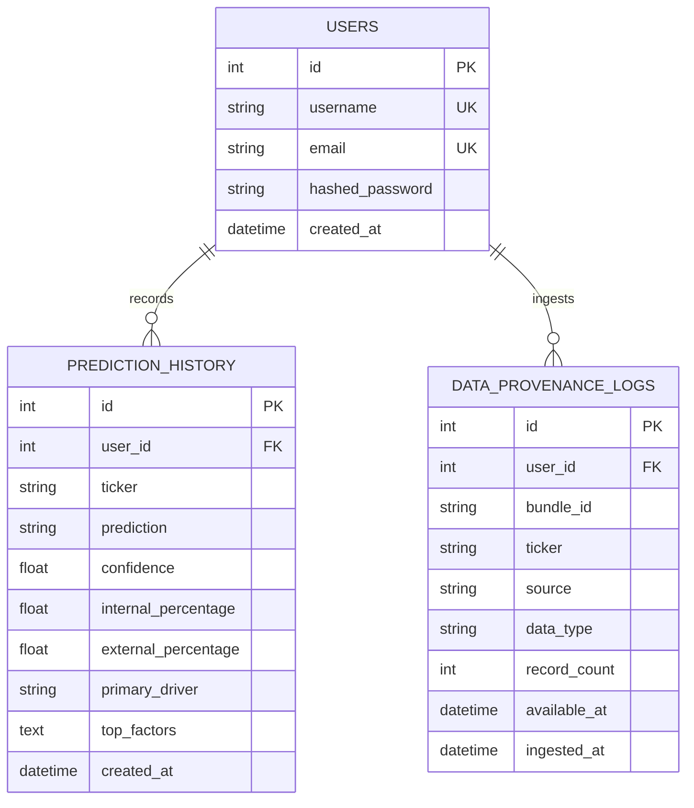
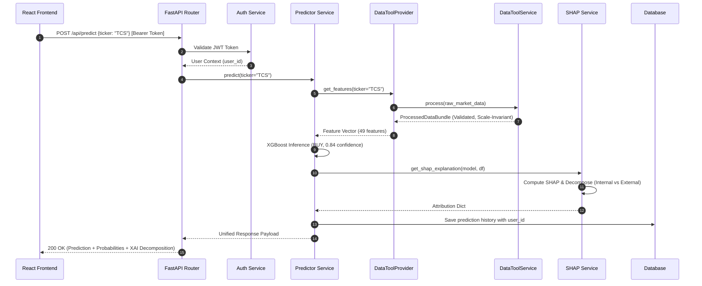

# StockDNA-AI Architecture Specification

## 1. System Overview

StockDNA-AI is an institutional-grade, explainable machine learning platform for Indian equities (NSE/NIFTY). It moves beyond black-box classification by unifying three core pillars:
1. **Independent Data Aggregation & Automated Classification Tool (`data_tool/`)**
2. **Predictive Machine Learning Pipeline (`models/`, `scripts/ml/`, `backend/predictor.py`)**
3. **Decomposed Explainable AI (XAI) Engine (`backend/services/shap_service.py`)**

The platform is exposed through a high-performance **FastAPI** backend with authenticated relational persistence and served to an interactive **React** frontend dashboard.



---

## 2. Component 1: Independent Data Tool (`data_tool/`)

### 2.1 Purpose and Separation
The Data Tool is a **completely standalone, reusable data engineering and classification service**. It operates under zero knowledge of downstream machine learning algorithms (it does not know or care whether the consumer is XGBoost, Random Forest, an LSTM, or a human analyst).

### 2.2 Core Responsibilities
1. **Multi-Source Ingestion**: Ingests raw tabular data, OHLCV time series, quarterly earnings reports, and unstructured financial headlines.
2. **Robust Cleaning & Normalization**: Standardizes heterogenous column headers (`DATE`, `Price`, `date` $\to$ `Date`), cleans string anomalies (currency symbols, commas), enforces numeric constraints (positive prices), and filters corrupted records without dropping schema definitions.
3. **Time-Ordered Deduplication**: Identifies identical records based on chronological uniqueness keys (e.g., `['Ticker', 'Date']`) while maintaining audit statistics of removed entries.
4. **Automated Classification & Taxonomy**:
   - **Factor Classification**: Classifies every variable into `INTERNAL` (company-specific micro factors) vs. `EXTERNAL` (macro, sector, and technical factors).
   - **Market Regime Detection**: Classifies market behavior into `BULL_TRENDING`, `BEAR_TRENDING`, `SIDEWAYS`, and `HIGH_VOLATILITY` / `LOW_VOLATILITY`.
   - **Earnings Surprise Classification**: Categorizes EPS performance into `BEAT`, `MISS`, or `IN_LINE` relative to consensus estimates.
   - **Financial Sentiment Analysis**: NLP sentiment scoring (`POSITIVE`, `NEUTRAL`, `NEGATIVE`) tailored to financial phraseology.
5. **Scale-Invariant Feature Engineering**: Computes percentage spreads, normalized indicators (Normalized ATR, Normalized MACD, Bollinger %B, moving-average distance ratios) ensuring that nominal share prices (e.g., MRF at ₹130,000 vs. Tata Steel at ₹150) never distort machine learning weights.
6. **Point-in-Time Data Provenance**: Tags every record with an immutable `ProvenanceMetadata` stamp (`source`, `available_at`, `ingested_at`, `quality_flags`) preventing lookahead bias.

### 2.3 Public Service Interface
The Data Tool is consumed via `DataToolService` or its command-line/API endpoints:

```python
from data_tool import DataToolService, DataCategory, DataType

service = DataToolService()

# Ingest and process market data
market_bundle = service.process(
    data=raw_df,
    source="nse_feed",
    data_type=DataType.MARKET_PRICE,
    ticker="TCS"
)

# Convert to model-ready DataFrame with provenance columns
df = market_bundle.to_dataframe()
```

---

## 3. Component 2: Prediction Pipeline (`scripts/ml/`, `backend/predictor.py`)

### 3.1 Decision Objectives
The prediction engine produces an institutional 3-class signal for swing horizon forecasting:
- **BUY (Class 2)**: Favorable risk/reward with high probability of positive upward drift.
- **HOLD (Class 1)**: Ambiguous risk, sideways consolidation, or balanced risk/reward.
- **SELL (Class 0)**: Unfavorable regime, negative momentum, or elevated downside volatility.

### 3.2 Model Characteristics
- **Algorithm**: Gradient Boosted Decision Trees (`XGBClassifier`) calibrated to multi-class log-loss.
- **Outputs**:
  - Discrete class recommendation (`BUY`, `HOLD`, `SELL`).
  - Prediction confidence score ($C \in [0.0, 1.0]$, representing the maximum softmax class probability).
  - Full probability distribution across all three classes ($\sum P_i = 1.0$).
- **Features**: A curated set of 49 technical, macro, and fundamental indicators:
  - Technical: Moving average ratios, RSI(14), MACD histogram, Bollinger %B, ATR, momentum lags.
  - Macro: NIFTY 50 returns, India VIX levels and percentage changes.
  - Fundamentals: P/E ratio, Market Cap, Beta, Trailing & Forward EPS, Quarterly Earnings Growth.

---

## 4. Component 3: Explainable AI (XAI) Layer (`backend/services/shap_service.py`)

### 4.1 Decomposed Attribution Framework
Traditional feature importance gives an unstructured list of 50 features that overwhelms users. StockDNA-AI groups SHAP attribution into two fundamental economic pillars:

1. **INTERNAL Factors (Company-Specific)**:
   - Quarterly Earnings Surprises, EPS growth, and announcement recency.
   - Valuation multiples: P/E ratio, Forward P/E, Book Value.
   - Financial health: Debt/Equity, Operating Margins, Return on Equity.
2. **EXTERNAL Factors (Market & Macro)**:
   - Market benchmark dynamics: NIFTY 50 trend and momentum.
   - Volatility index: India VIX spike or contraction.
   - Technical momentum: RSI, MACD crossovers, Moving Average distances, Bollinger bandwidth.
   - News sentiment and macroeconomic regime.

### 4.2 Mathematical Attribution
Let $\phi_i$ denote the SHAP value of feature $i$ for the predicted class. The total absolute explanation force is:
$$\Phi_{total} = \sum_{i \in \text{all features}} |\phi_i|$$

The decomposed percentage contributions are calculated as:
$$\text{Internal Share (\%)} = \left( \frac{\sum_{i \in \text{INTERNAL}} |\phi_i|}{\Phi_{total}} \right) \times 100$$
$$\text{External Share (\%)} = \left( \frac{\sum_{i \in \text{EXTERNAL}} |\phi_i|}{\Phi_{total}} \right) \times 100$$

### 4.3 Output Contract
```json
{
  "ticker": "TCS",
  "prediction": "BUY",
  "confidence": 0.842,
  "internal_percentage": 38.5,
  "external_percentage": 61.5,
  "primary_driver": "EXTERNAL",
  "top_internal_factors": [
    {"feature": "TrailingEPS", "importance": 0.184, "direction": "POSITIVE"},
    {"feature": "PE_Ratio", "importance": 0.121, "direction": "NEGATIVE"}
  ],
  "top_external_factors": [
    {"feature": "NIFTY_Return", "importance": 0.312, "direction": "POSITIVE"},
    {"feature": "RSI", "importance": 0.228, "direction": "POSITIVE"}
  ]
}
```

### 4.4 High-Performance Caching
SHAP computations on tree ensembles can be computationally intensive if re-initialized per request. `backend/services/shap_service.py` maintains an in-memory `_EXPLAINER_CACHE` keyed by model memory address, reusing compiled `shap.TreeExplainer` instances for sub-10ms inference.

---

## 5. Component 4: Backend Architecture (`backend/`)

Built with **FastAPI**, the backend provides asynchronous, strongly-typed REST APIs:

```
backend/
├── app.py                     # App factory, CORS middleware, router aggregation
├── schemas.py                 # Pydantic request/response validation schemas
├── predictor.py               # ML prediction orchestration service
├── routers/
│   ├── auth.py                # User registration, JWT login, token refresh
│   ├── prediction.py          # /api/predict endpoint (ML + XAI)
│   ├── history.py             # User-isolated prediction history CRUD
│   └── datatool.py            # /api/data-tool endpoints (data processing & NLP)
├── services/
│   ├── auth_service.py        # bcrypt password hashing, JWT encoding/decoding
│   ├── history_service.py     # Database queries for user prediction audit logs
│   ├── shap_service.py        # Cached SHAP explanation and factor decomposition
│   ├── feature_service.py     # Real-time technical feature calculation
│   ├── fundamentals_service.py# Fundamental data retrieval
│   ├── market_service.py      # Macro index (NIFTY/VIX) retrieval
│   └── news_service.py        # RSS and financial news ingestion
└── database/
    ├── database.py            # SQLAlchemy engine, session maker, connection pool
    └── models.py              # Relational models (User, PredictionHistory, DataProvenanceLog)
```

### 5.1 Route Overview
- `POST /api/auth/register`: Create user with hashed credentials.
- `POST /api/auth/login`: Authenticate and receive signed JWT bearer token.
- `POST /api/predict`: Execute full ML inference pipeline with SHAP explanation.
- `GET /api/history`: Retrieve authenticated user's prediction history.
- `DELETE /api/history/{id}`: Delete a history record belonging to the authenticated user.
- `POST /api/data-tool/process`: Standalone endpoint to clean and structure raw data.
- `POST /api/data-tool/sentiment`: Classify text sentiment using financial domain heuristics.
- `POST /api/data-tool/classify-factor`: Classify a variable into `INTERNAL` or `EXTERNAL`.

---

## 6. Component 5: Database Architecture

The persistence layer uses **SQLAlchemy 2.0** ORM and supports dual-mode operation:
- **Local Development / Testing**: Zero-configuration SQLite (`stockdna.db`).
- **Production Deployment**: PostgreSQL connection via `DATABASE_URL` environment variable with automatic schema pooling.

### 6.1 Schema Entity-Relationship


---

## 7. Component 6: Frontend Architecture (`frontend/`)

The frontend is a modern React/Vite single-page application communicating with FastAPI:
1. **Prediction & Confidence Dashboard**:
   - Ticker selector driven by centralized company universe.
   - Real-time prediction banner (BUY/HOLD/SELL) with confidence gauge.
2. **XAI Factor Decomposition View**:
   - Donut / split bar chart displaying Internal vs. External percentage split.
   - Dual-column breakdown of top company-specific vs. top macroeconomic/technical drivers.
3. **Data Tool Ingestion Studio**:
   - UI for previewing raw ingested CSVs, executing automated deduplication, and visualizing data cleaning metrics and provenance metadata.

---

## 8. Communication Between Components & Data Flow

Communication between layers is strictly decoupled using explicit service contracts and interfaces.



---

## 9. Why the Data Tool is Decoupled

The decision to decouple `data_tool/` into an independent component rather than intertwining it with model training scripts is rooted in core software engineering and financial machine learning principles:

### 1. Zero Model Leakage and Downstream Reusability
The Data Tool has no dependency on `xgboost`, `torch`, or specific prediction labels. If tomorrow the prediction pipeline migrates from XGBoost to a Temporal Fusion Transformer, a GBDT ensemble, or an automated portfolio optimizer, **the entire data ingestion, cleaning, deduplication, and provenance pipeline remains 100% reusable without changing a single line of data engineering code**.

### 2. Point-in-Time Correctness and Prevention of Lookahead Bias
In quantitative finance, lookahead bias (training on information that was not yet publicly known at the decision timestamp) is the primary reason backtests fail in live production. By maintaining strict `available_at` timestamps on every `StructuredRecord` and validating backward-looking merges during aggregation, the Data Tool guarantees that future quarterly earnings or revised reports never leak into historical bars.

### 3. Clear Contract via `BaseDataProvider`
The ML pipeline talks to an abstract interface:
```python
class BaseDataProvider(ABC):
    @abstractmethod
    def get_market_data(self, ticker: str, start_date: str, end_date: str) -> pd.DataFrame: ...
    @abstractmethod
    def get_features(self, ticker: str) -> Dict[str, float]: ...
```
The ML pipeline does not know whether data originated from local CSVs, the `DataToolService`, an external Bloomberg API, or a simulated backtest stream. This makes automated testing and mocking seamless.

### 4. Independent Testability
The Data Tool maintains its own independent test suite (`tests/test_data_tool.py`), allowing data ingestion, regex cleaning, missing value edge cases, and deduplication logic to be validated in milliseconds without loading heavy ML weights or models.

### 5. Architectural Cleanliness
Circular dependencies between data preparation scripts and model training scripts are completely eradicated. The dependency direction is strictly unidirectional:
$$\text{Data Ingestion} \longrightarrow \text{Data Tool} \longrightarrow \text{Data Provider Interface} \longleftarrow \text{Prediction Pipeline} \longrightarrow \text{XAI Engine}$$
